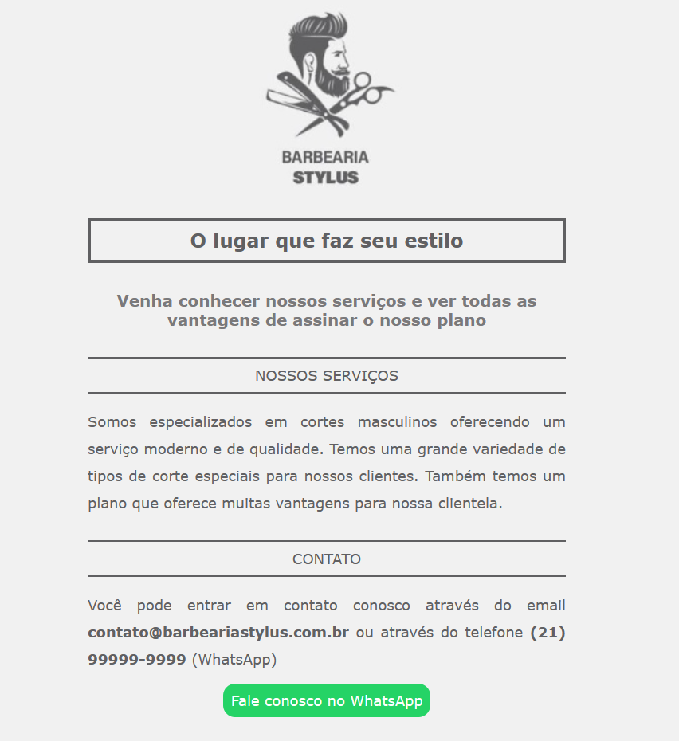

# Projeto-Iniciante-Front-07
O Projeto aqui é do nível Iniciante, utilizando HTML/CSS

 
    
    

#

#07 Barbearia Stylus

O projeto simula uma Pagina do Serviço da Barbearia, o projeto foi desenvolvido por mim <b>mesmo</b>. Nele foi utilizado algumas tags como:

<b>HTML</b>

- div
- link
- span
- link para o serviço do Whatsapp Web

<b>CSS</b>

- efeitos houver
- classes nos estilos
- transition
- transform

#

    

